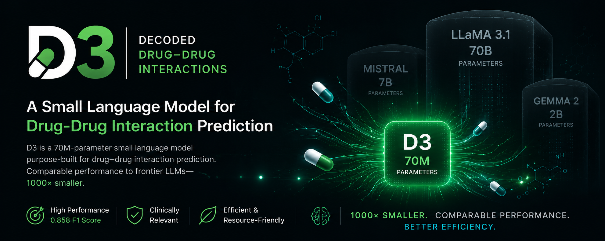

<p align="center">
  
</p>

<h1 align="center">D3: A Small Language Model for Drug-Drug Interaction Prediction</h1>

<p align="center">
  <a href="https://www.sciencedirect.com/science/article/pii/S2666827025000416"></a>
  <a href="https://huggingface.co/serag-ai"></a>
  <a href="http://creativecommons.org/licenses/by/4.0/"></a>
</p>

## Overview

**D3** is a specialized Small Language Model (SLM) with roughly **70M parameters**, designed for accurate and efficient **Drug-Drug Interaction (DDI) severity prediction**. Given a pair of drugs, D3 classifies the severity of their interaction as **minor**, **moderate**, or **major**.

Despite being up to **1,000x smaller** than the large language models it is compared against, D3 reaches a **0.858 F1 score** with competitive performance while requiring substantially fewer compute and memory resources, making it practical to run on modest hardware.

This repository contains the code and training/inference notebooks introduced in our paper:

> **D3: A Small Language Model for Drug-Drug Interaction prediction and comparison with Large Language Models**
> Ahmed Ibrahim, Abdullah Hosseini, Salma Ibrahim, Aamenah Sattar, and Ahmed Serag.
> *Machine Learning with Applications* (2025).
> [Read the paper on ScienceDirect](https://www.sciencedirect.com/science/article/pii/S2666827025000416)

## Key Features

- **Compact:** A GPT-style decoder transformer (~70M parameters) built from scratch in PyTorch.
- **Task-focused:** Trained end to end for three-class DDI severity classification (minor / moderate / major).
- **Reproducible:** Pretraining, fine-tuning, and inference are all reproducible from the included notebooks.
- **Benchmarked:** Compared against fine-tuned LLMs ranging from 1.5B to 70B parameters (Qwen 2.5, Gemma, Mistral, LLaMA 3.1).

## Repository Structure

- **`src/d3_pretraining_finetuning.ipynb`** — End-to-end D3 notebook: model definition, language-model pretraining, classification fine-tuning, and inference.
- **`src/llm_finetuning.ipynb`** — LoRA fine-tuning of the comparison LLMs (Qwen 2.5, Gemma 2, Mistral, LLaMA 3.1).
- **`assets/`** — Repository media (banner, figures).

The trained D3 checkpoint (`model_and_optimizer.pth`, ~1 GB) is not committed to Git; it is hosted on Hugging Face at [serag-ai/D3](https://huggingface.co/serag-ai/D3). Download it locally before running inference.

## Model Architecture

D3 is a GPT-style decoder-only transformer. The default configuration:

| Hyperparameter | Value |
|----------------|-------|
| Parameters | ~70M |
| Vocabulary size | 50,257 (GPT-2 / `tiktoken` BPE) |
| Context length | 256 tokens |
| Embedding dimension | 512 |
| Attention heads | 8 |
| Transformer layers | 6 |
| Dropout | 0.1 |

The training pipeline first pretrains the language model on a general text corpus (`Haxirus/rasbt_pretraining_data` on Hugging Face), then fine-tunes it for DDI severity classification.

## Installation

```bash
git clone https://github.com/serag-ai/D3.git
cd D3

python -m venv .venv
# Windows
.venv\Scripts\activate
# Linux / macOS
source .venv/bin/activate

pip install torch tiktoken numpy datasets matplotlib
```

Core dependencies: `torch`, `tiktoken`, `numpy`. The notebooks additionally use `datasets`, `matplotlib`, and (optionally) `wandb` for experiment logging. LLM fine-tuning in `src/llm_finetuning.ipynb` also uses `transformers`, `peft`, and `unsloth`.

## Usage

### Training, Fine-Tuning, and Inference

Open `src/d3_pretraining_finetuning.ipynb` and run the cells in order to reproduce the full pipeline: model initialization, language-model pretraining, classification fine-tuning (with loss/accuracy curves), checkpoint saving, and inference.

For inference with the released checkpoint, download `model_and_optimizer.pth` from [Hugging Face](https://huggingface.co/serag-ai/D3), point the notebook's `checkpoint_path` at the local file, and run the inference section with a query such as:

```python
query = "What is the severity of interaction between Calcium carbonate and Doxycycline?"
```

### Reproducing the LLM Comparison

`src/llm_finetuning.ipynb` contains the LoRA fine-tuning pipeline used to train and evaluate the larger comparison models (Qwen 2.5, Gemma 2, Mistral, LLaMA 3.1) on the same DDI dataset.

## Models on Hugging Face

All comparison models below were fine-tuned on the same DDI dataset using a parameter-efficient LoRA strategy.

| Model | Parameters | Hugging Face |
|-------|------------|--------------|
| D3 | 70M | [serag-ai/D3](https://huggingface.co/serag-ai/D3) |
| Qwen 2.5 (fine-tuned) | 1.5B | [serag-ai/Finetuned-DDI-Qwen](https://huggingface.co/serag-ai/Finetuned-DDI-Qwen) |
| Gemma 2B (fine-tuned) | 2B | [serag-ai/Finetuned-DDI-Gemma](https://huggingface.co/serag-ai/Finetuned-DDI-Gemma) |
| Mistral v0.3 (fine-tuned) | 7B | [serag-ai/Finetuned-DDI-Mistral](https://huggingface.co/serag-ai/Finetuned-DDI-Mistral) |
| LLaMA 3.1 (fine-tuned) | 70B | Not uploaded (size constraints) |

## Citation

If you use D3 or this code in your research, please cite:

```bibtex
@article{ibrahim2025d3,
  title   = {D3: A Small Language Model for Drug-Drug Interaction prediction and comparison with Large Language Models},
  author  = {Ibrahim, Ahmed and Hosseini, Abdullah and Ibrahim, Salma and Sattar, Aamenah and Serag, Ahmed},
  journal = {Machine Learning with Applications},
  year    = {2025},
  url     = {https://www.sciencedirect.com/science/article/pii/S2666827025000416}
}
```

## Acknowledgements

This work builds on open-source efforts from the community, including
[Sebastian Raschka](https://github.com/rasbt) (*Build a Large Language Model from Scratch*) and
[Unsloth](https://github.com/unslothai/unsloth).

## License

Released under the [Creative Commons Attribution 4.0 International (CC BY 4.0)](http://creativecommons.org/licenses/by/4.0/) license.
